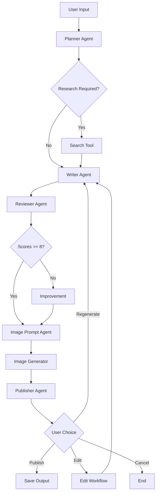

# AI LinkedIn Content Agent

<div align="center">


**An intelligent multi-agent system for generating professional LinkedIn content**

[Features](#features) • [Architecture](#architecture) • [Installation](#installation) • [Usage](#usage)

</div>

---

## Overview

The AI LinkedIn Content Agent is a sophisticated multi-agent system that leverages Large Language Models (LLMs) to generate high-quality, personalized LinkedIn posts. Built with LangChain and powered by Google's Gemini AI, this system orchestrates multiple specialized agents to plan, research, write, review, and enhance content with AI-generated images.

The agent uses a modular architecture where each component has a specific responsibility—from planning the content strategy to generating relevant images—ensuring professional, engaging, and authentic LinkedIn posts tailored to your profile and preferences.

---

## Features

### 🤖 Multi-Agent Architecture
- **Planning Agent** - Analyzes user intent and creates execution plans
- **Research Agent** - Performs web search for current information
- **Writer Agent** - Generates content with personalization
- **Reviewer Agent** - Scores and improves content quality
- **Image Prompt Agent** - Creates detailed image generation prompts
- **Publisher Agent** - Manages preview and publishing workflow

### 🎨 Content Personalization
- **User Profile System** - Loads your professional background, skills, and achievements
- **Writing Style Detection** - Automatically detects preferred writing style (professional, casual, beginner-friendly, etc.)
- **Style Templates** - Multiple pre-configured writing style prompts
- **Context-Aware Generation** - Incorporates your expertise and experience

### 🔄 Human-in-the-Loop Workflow
- **Regeneration** - Regenerate content up to 5 times with counter tracking
- **Edit Workflow** - Provide feedback to refine content
- **Preview System** - Rich terminal UI for content and image preview
- **Choice Selection** - Publish, regenerate, edit, or cancel options

### 🎯 Quality Assurance
- **Automated Review** - Scores content on clarity, engagement, authenticity, and readability
- **Auto-Improvement** - Automatically improves content if scores are below threshold
- **Structured Output** - Consistent title, content, and hashtags format

### 🖼️ AI Image Generation
- **Image Prompt Generation** - Creates detailed prompts for AI image models
- **Style Selection** - Multiple illustration styles (minimalist, corporate, abstract, etc.)
- **Automatic Download** - Downloads and saves generated images
- **Aspect Ratio Support** - Configurable image dimensions

### 💻 Developer Experience
- **Rich Terminal UI** - Beautiful console output with colors and formatting
- **Configuration System** - Environment-based configuration
- **Modular Codebase** - Clean separation of concerns
- **Error Handling** - Graceful error messages and recovery

---

## Architecture

The system follows a modular architecture with clear separation of concerns:

### Components

**Agents** - AI reasoning and content generation
- Planner: Analyzes intent and creates execution plans
- Writer: Generates LinkedIn content with personalization
- Reviewer: Scores and improves content quality
- Image Prompt: Creates detailed image generation prompts

**Services** - External integrations and utilities
- Search: Web search via DuckDuckGo
- LLM: Gemini AI wrapper for text generation
- LinkedIn: Publishing workflow (placeholder for future API integration)
- Image Generation: AI image generation service

**Workflows** - Orchestration and execution flow
- CLI Workflow: Terminal-based content creation pipeline

The system follows a pipeline architecture where each agent processes the output of the previous agent:



### Agent Responsibilities

| Agent | Responsibility | Output |
|-------|---------------|--------|
| **Planner** | Analyze intent, detect style, create plan | Execution plan with tone, intent, research flag |
| **Search** | Web search for current information | Search results with titles, snippets, URLs |
| **Writer** | Generate LinkedIn post with personalization | Structured post (title, content, hashtags) |
| **Reviewer** | Score and improve content quality | Review scores, feedback, improved post |
| **Image Prompt** | Generate image generation prompt | Image prompt with style, aspect ratio, filename |
| **Publisher** | Preview and manage publishing workflow | User choice (publish, regenerate, edit, cancel) |

---

## Folder Structure

```
LINKEDIN_AGENT/
├── app.py                  # FastAPI application entry point
├── config/                 # Configuration module
│   ├── __init__.py
│   └── config.py           # Configuration management
├── agents/                 # Agent implementations
│   ├── __init__.py
│   ├── planner.py          # Planning and style detection
│   ├── writer.py           # Content generation
│   ├── reviewer.py         # Content review and improvement
│   ├── image_prompt.py     # Image prompt generation
│   └── publisher.py        # Preview and publishing
├── workflows/              # Workflow orchestration
│   ├── __init__.py
│   └── cli_workflow.py     # CLI workflow implementation
├── services/               # External service integrations
│   ├── __init__.py
│   ├── llm.py              # LLM wrapper for Gemini
│   ├── search.py           # DuckDuckGo web search
│   ├── image_generator.py  # AI image generation
│   └── linkedin/           # LinkedIn publishing (placeholder)
│       ├── __init__.py
│       └── README.md
├── database/               # Data storage
│   ├── __init__.py
│   ├── profile.json        # User profile data
│   └── profile.template.json
├── models/                 # Data models
│   ├── __init__.py
│   ├── models.py           # Shared data models
│   └── profile_models.py   # Profile data models
├── prompts/                # Prompt templates
│   ├── __init__.py
│   └── styles/             # Writing style prompts
│       ├── __init__.py
│       ├── professional.txt
│       ├── storytelling.txt
│       ├── technical_deep_dive.txt
│       ├── educational.txt
│       ├── founder.txt
│       ├── career_journey.txt
│       ├── beginner_friendly.txt
│       ├── opinion.txt
│       ├── product_launch.txt
│       └── hiring.txt
├── utils/                  # Shared utilities
│   ├── __init__.py
│   ├── parsers.py          # Response parsing utilities
│   ├── profile_manager.py  # Profile loading and validation
│   ├── style_manager.py    # Writing style detection
│   └── logger.py           # Logging configuration
├── tests/                  # Test suite
│   └── __init__.py
├── docs/                   # Documentation
│   └── __init__.py
├── output/                 # Generated content
│   └── images/             # Generated images
├── requirements.txt        # Python dependencies
├── .env.example            # Environment variables template
├── .gitignore              # Git ignore rules
├── README.md               # This file
├── LICENSE                 # MIT License
├── CHANGELOG.md            # Version history
├── PROJECT_ARCHITECTURE.md # Detailed architecture
├── CONTRIBUTING.md         # Contribution guidelines
├── CODE_OF_CONDUCT.md      # Community guidelines
└── ROADMAP.md              # Future plans
```

---

## Installation

### Prerequisites

- Python 3.11 or higher
- pip (Python package manager)
- Gemini API key from [Google AI Studio](https://makersuite.google.com/app/apikey)

### Step 1: Clone the Repository

```bash
git clone https://github.com/think11723/LINKEDIN-AGENT.git
cd LINKEDIN-AGENT
```

### Step 2: Create Virtual Environment

```bash
python -m venv .venv

# Windows
.venv\Scripts\activate

# Linux/Mac
source .venv/bin/activate
```

### Step 3: Install Dependencies

```bash
pip install -r requirements.txt
```

### Step 4: Configure Environment

```bash
cp .env.example .env
```

Edit `.env` and add your API key:

```env
GEMINI_API_KEY=your_gemini_api_key_here
MODEL_NAME=gemini-3.5-flash
TEMPERATURE=0.7
```

### Step 5: Set Up Profile

Edit `database/profile.json` with your information:

```json
{
  "basic_info": {
    "full_name": "Your Name",
    "headline": "Your Professional Headline",
    "current_role": "Your Current Role",
    "organisation": "Your Organization"
  },
  "skills": {
    "technical_skills": ["Python", "JavaScript", "AI"],
    "soft_skills": ["Communication", "Problem Solving"]
  },
  ...
}
```

---

## Usage

### Run CLI Application

```bash
python -m workflows.cli_workflow
```

### Run Web API

```bash
uvicorn app:app --reload
```

The API will be available at `http://localhost:8000`

Health check: `GET /`

### Example Prompts

**Professional Post:**
```
Create a LinkedIn post about the future of AI Agents in software development
```

**Casual Post:**
```
Write a fun post about my experience learning Python
```

**Technical Post:**
```
Explain the benefits of using LangChain for building AI applications
```

**Personal Story:**
```
Share my journey from traditional web development to AI engineering
```

### Workflow

1. **Enter your topic** - Describe what you want to post about
2. **Planning** - Agent analyzes intent and creates execution plan
3. **Research** (if needed) - Web search for current information
4. **Writing** - Content generation with personalization
5. **Review** - Automated scoring and improvement
6. **Image Generation** - AI-generated illustration
7. **Preview** - Review content and image
8. **Choose Action** - Publish, regenerate, edit, or cancel

### Regeneration

If you want to regenerate the content:
- Select `[R] Regenerate` at the preview
- The system will regenerate with context preservation
- You can regenerate up to 5 times

### Edit Workflow

If you want to provide feedback:
- Select `[E] Edit` at the preview
- Enter your feedback (e.g., "Make it more engaging", "Add more technical details")
- The system will regenerate with your feedback incorporated

---

## Screenshots

### Welcome Screen
*[Screenshot of welcome screen with example prompt]*

### Planning Phase
*[Screenshot of execution plan display]*

### Content Generation
*[Screenshot of writing phase with spinner]*

### Review Scores
*[Screenshot of review scores table]*

### Preview with Image
*[Screenshot of final preview with post and image]*

---

## Roadmap

### Completed (v1.0)

- ✅ Multi-agent architecture
- ✅ Planning and intent detection
- ✅ Web search integration
- ✅ Content generation with personalization
- ✅ Automated review and improvement
- ✅ Image prompt generation
- ✅ AI image generation
- ✅ Multiple writing styles
- ✅ User profile system
- ✅ Regeneration workflow
- ✅ Edit workflow
- ✅ Rich terminal UI
- ✅ Configuration system

### Planned (v2.0)

- 🔄 LinkedIn API integration for direct publishing
- 🔄 RAG (Retrieval-Augmented Generation) for content research
- 🔄 LangGraph workflow orchestration
- 🔄 Content scheduling
- 🔄 Analytics and engagement tracking
- 🔄 A/B testing for content variants
- 🔄 Hashtag optimization
- 🔄 Multi-language support
- 🔄 Enhanced web interface
- 🔄 Content history and versioning
- 🔄 Template library
- 🔄 Export to multiple formats (PDF, HTML)
- 🔄 Email notifications
- 🔄 OAuth authentication flow

---

## Contributing

Contributions are welcome! Please read [CONTRIBUTING.md](CONTRIBUTING.md) for details on our code of conduct and the process for submitting pull requests.

### Development Setup

1. Fork the repository
2. Create a feature branch (`git checkout -b feature/amazing-feature`)
3. Make your changes
4. Run tests and ensure code quality
5. Commit your changes (`git commit -m 'Add amazing feature'`)
6. Push to the branch (`git push origin feature/amazing-feature`)
7. Open a Pull Request

---

## License

This project is licensed under the MIT License - see the [LICENSE](LICENSE) file for details.

---

## Acknowledgments

- [LangChain](https://github.com/langchain-ai/langchain) - Framework for building LLM applications
- [Google Gemini](https://ai.google.dev/) - LLM provider
- [Rich](https://rich.readthedocs.io/) - Terminal UI library
- [Pollinations.ai](https://pollinations.ai/) - AI image generation
- [DuckDuckGo](https://duckduckgo.com/) - Web search API

---

## Contact

- **Author:** [Your Name]
- **Project Link:** [https://github.com/think11723/LINKEDIN-AGENT](https://github.com/think11723/LINKEDIN-AGENT)

---

<div align="center">

**Built with ❤️ for the AI community**

[⬆ Back to Top](#ai-linkedin-content-agent)

</div>
