# AI LinkedIn Content Agent

<div align="center">


**An intelligent multi-agent system for generating professional LinkedIn content**

[Features](#features) • [Architecture](#architecture) • [Installation](#installation) • [Usage](#usage) • [Testing](#testing)

</div>

---

## Overview

The AI LinkedIn Content Agent is a sophisticated multi-agent system that leverages Large Language Models (LLMs) to generate high-quality, personalized LinkedIn posts. Built with LangChain, LangGraph, and powered by Google's Gemini AI, this system orchestrates multiple specialized agents to plan, research, write, review, and publish content with optional image attachments and scheduled publishing capabilities.

The agent uses a modular architecture where each component has a specific responsibility—from planning the content strategy to publishing to LinkedIn—ensuring professional, engaging, and authentic LinkedIn posts tailored to your profile and preferences.

---

## Features

### 🤖 Multi-Agent Architecture
- **Planning Agent** - Analyzes user intent and creates execution plans
- **Research Agent** - Performs web search for current information
- **Writer Agent** - Generates content with personalization
- **Reviewer Agent** - Multi-dimensional scoring and improvement
- **LangGraph Orchestration** - Graph-based workflow execution

### 🧠 Memory System (RAG)
- **Content Memory** - Stores previous posts for context enrichment
- **Semantic Retrieval** - Finds relevant past posts using vector similarity
- **Avoids Repetition** - Helps maintain originality and consistency
- **Lightweight Embeddings** - 32-dimensional vectors via LLM
- **Persistent Storage** - Survives application restarts

### ⏰ Scheduled Publishing
- **Flexible Scheduling** - Schedule posts by minutes, hours, or specific time
- **Job Persistence** - Scheduled jobs survive application restarts
- **Automatic Execution** - Background runner executes scheduled jobs
- **Retry Logic** - Automatic retry on publishing failures
- **Image Support** - Schedule posts with attached images

### 🖼️ Image Support
- **Optional Attachments** - Attach images to posts (PNG, JPG, JPEG, WEBP)
- **Validation** - File existence and format validation
- **Publish with Image** - LinkedIn API image upload
- **Schedule with Image** - Persist image path in scheduled jobs
- **Fallback Option** - Publish text-only if image fails

### 🔗 LinkedIn Integration
- **OAuth Authentication** - Secure LinkedIn OAuth2 flow
- **Direct Publishing** - Publish text and image posts to LinkedIn
- **Token Storage** - Persistent token management
- **Error Handling** - Graceful failure with clear messages

### 🎨 Content Personalization
- **User Profile System** - Loads your professional background, skills, and achievements
- **Writing Style Detection** - Automatically detects preferred writing style
- **Style Templates** - Multiple pre-configured writing style prompts
- **Context-Aware Generation** - Incorporates your expertise and experience

### 🔄 Human-in-the-Loop Workflow
- **Regeneration** - Regenerate content with automatic retry logic
- **Edit Workflow** - Provide feedback to refine content
- **Preview System** - Rich terminal UI for content preview
- **Choice Selection** - Publish, schedule, regenerate, edit, save, or cancel

### 🎯 Quality Assurance
- **Multi-Dimensional Review** - Scores content on 8 dimensions
- **Auto-Improvement** - Automatically improves content if scores are below threshold
- **Structured Output** - Consistent title, content, and hashtags format
- **Decision Logic** - Clear approve/reject decisions with confidence

### 💻 Developer Experience
- **Rich Terminal UI** - Beautiful console output with colors and formatting
- **Configuration System** - Environment-based configuration
- **Modular Codebase** - Clean separation of concerns
- **Error Handling** - Graceful error messages and recovery
- **Test Suite** - Automated tests for critical functionality

---

## Architecture

The system follows a modular architecture with clear separation of concerns:

### Components

**Agents** - AI reasoning and content generation
- Planner: Analyzes intent and creates execution plans
- Writer: Generates LinkedIn content with personalization
- Reviewer: Multi-dimensional scoring and improvement

**Services** - External integrations and utilities
- Context Builder: Builds unified context from profile and memory
- Research: Web search via DuckDuckGo
- LLM: Gemini AI wrapper for text generation
- LinkedIn: OAuth authentication and publishing
- Memory: RAG system for content memory
- Scheduler: Job scheduling and execution

**Workflows** - Orchestration and execution flow
- LangGraph Workflow: Graph-based content creation pipeline
- Scheduler Runner: Background job execution

The system follows a pipeline architecture orchestrated by LangGraph:

```mermaid
graph TD
    A[User Input] --> B[Context Builder]
    B --> C[Research Service]
    C --> D[Planner Agent]
    D --> E[Writer Agent]
    E --> F[Reviewer Agent]
    F --> G{Approved?}
    G -->|Yes| H[Memory Index]
    G -->|No| E
    H --> I[User Choice]
    I -->|Publish Now| J[LinkedIn Service]
    I -->|Schedule| K[Scheduler Service]
    I -->|Attach Image| L[Image Attachment]
    I -->|Regenerate| D
    I -->|Edit| M[Edit Workflow]
    M --> D
    I -->|Cancel| N[End]
```



### Agent Responsibilities

| Agent | Responsibility | Output |
|-------|---------------|--------|
| **Context Builder** | Builds unified context from profile, memory, and config | Context object with user info and memory |
| **Research** | Web search for current information | Search results with titles, snippets, URLs |
| **Planner** | Analyze intent, detect style, create plan | Execution plan with tone, intent, research flag |
| **Writer** | Generate LinkedIn post with personalization | Structured post (title, content, hashtags) |
| **Reviewer** | Multi-dimensional scoring and improvement | Review scores, feedback, decision, confidence |
| **Memory** | Store and retrieve previous posts | Memory summary for context enrichment |
| **Scheduler** | Schedule and execute posts | Job lifecycle management |

---

## Folder Structure

```
LINKEDIN_AGENT/
├── app.py                  # CLI application entry point
├── config/                 # Configuration module
│   ├── __init__.py
│   └── config.py           # Configuration management
├── agents/                 # Agent implementations
│   ├── __init__.py
│   ├── planner.py          # Planning and style detection
│   ├── writer.py           # Content generation
│   └── reviewer.py         # Content review and improvement
├── workflows/              # Workflow orchestration
│   ├── __init__.py
│   ├── content_workflow.py # Workflow wrapper
│   └── graph_workflow.py   # LangGraph workflow
├── services/               # External service integrations
│   ├── __init__.py
│   ├── llm.py              # LLM wrapper for Gemini
│   ├── research/           # Research service
│   ├── linkedin/           # LinkedIn publishing
│   │   ├── __init__.py
│   │   ├── auth.py
│   │   ├── publisher.py
│   │   ├── service.py
│   │   └── token_storage.py
│   └── context_builder.py  # Context building
├── memory/                 # RAG memory system
│   ├── __init__.py
│   ├── models.py
│   ├── vector_store.py
│   ├── embeddings.py
│   ├── retriever.py
│   ├── indexer.py
│   └── service.py
├── scheduler/              # Scheduled publishing
│   ├── __init__.py
│   ├── models.py
│   ├── job_store.py
│   ├── runner.py
│   ├── service.py
│   └── runner_cli.py
├── database/               # Data storage
│   ├── profile.json        # User profile data
│   └── profile.template.json
├── models/                 # Data models
│   ├── __init__.py
│   ├── models.py           # Shared data models
│   ├── profile_models.py   # Profile data models
│   └── workflow_models.py  # Workflow state models
├── prompts/                # Prompt templates
│   ├── __init__.py
│   └── styles/             # Writing style prompts
├── utils/                  # Shared utilities
│   ├── __init__.py
│   ├── draft_saver.py      # Draft saving
│   ├── profile_manager.py  # Profile loading and validation
│   ├── style_manager.py    # Writing style detection
│   └── logger.py           # Logging configuration
├── tests/                  # Test suite
│   ├── __init__.py
│   ├── test_workflow.py
│   ├── test_memory.py
│   ├── test_scheduler.py
│   ├── test_cli.py
│   └── test_utils.py
├── output/                 # Generated content
│   └── drafts/             # Saved drafts
├── requirements.txt        # Python dependencies
├── .env.example            # Environment variables template
├── .gitignore              # Git ignore rules
└── README.md               # This file
```

---

## Installation

### Prerequisites

- Python 3.11 or higher
- pip (Python package manager)
- Gemini API key from [Google AI Studio](https://makersuite.google.com/app/apikey)
- LinkedIn API credentials (for publishing)

### Step 1: Clone the Repository

```bash
git clone https://github.com/think11723/LINKEDIN-AGENT.git
cd LINKEDIN_AGENT
```

### Step 2: Create Virtual Environment

```bash
python -m venv .venv

# Windows
.venv\Scripts\activate

# Linux/Mac
source .venv/bin/activate
```

### Step 3: Install Dependencies

```bash
pip install -r requirements.txt
```

### Step 4: Configure Environment

```bash
cp .env.example .env
```

Edit `.env` and add your API keys:

```env
# Gemini AI Configuration
GEMINI_API_KEY=your_gemini_api_key_here
MODEL_NAME=gemini-3.5-flash
TEMPERATURE=0.7

# LinkedIn Configuration (for publishing)
LINKEDIN_CLIENT_ID=your_linkedin_client_id
LINKEDIN_CLIENT_SECRET=your_linkedin_client_secret
LINKEDIN_REDIRECT_URI=http://localhost:8000/callback
```

### Step 5: Set Up Profile (Optional)

Edit `database/profile.json` with your information for personalized content:

```json
{
  "basic_info": {
    "full_name": "Your Name",
    "headline": "Your Professional Headline",
    "current_role": "Your Current Role",
    "organisation": "Your Organization"
  },
  "skills": {
    "technical_skills": ["Python", "JavaScript", "AI"],
    "soft_skills": ["Communication", "Problem Solving"]
  },
  ...
}
```

---

## Usage

### Run CLI Application

```bash
python app.py
```

This will launch the interactive CLI runner that:
1. Displays a welcome message
2. Prompts you to enter a LinkedIn topic
3. Runs the LangGraph workflow (Context Builder → Research → Planner → Writer → Reviewer)
4. Displays the generated post with metrics
5. Offers options to regenerate, edit, attach image, save draft, publish to LinkedIn, schedule publish, or exit

### Attach Images

1. Generate a post
2. Select "4. Attach Image" from the menu
3. Enter the path to your image (PNG, JPG, JPEG, WEBP)
4. The image will be validated and attached to the draft
5. Publish or schedule with the attached image

### Schedule Posts

1. Generate a post
2. Select "6. Schedule Publish" from the menu
3. Choose scheduling option (minutes, hours, or specific time)
4. The post will be scheduled and persisted
5. Run the scheduler runner to execute scheduled jobs

### Run Scheduler Runner

```bash
python scheduler/runner_cli.py
```

The scheduler runner will:
1. Display current scheduler statistics
2. Prompt for check interval (default 60 seconds)
3. Periodically check for due jobs
4. Execute jobs by calling LinkedIn Service
5. Handle failures with retry logic

### Save Drafts

Drafts are automatically saved to `output/drafts/` as JSON files with timestamps when you choose the "Save Draft" option.

### Edit Drafts

You can manually edit the generated draft before publishing or saving:
- Select "2. Edit Draft" from the menu
- Edit the title, content, and hashtags
- Press Enter to keep the current value for any field
- The edited version becomes the current draft

### Regenerate Posts

Select "1. Regenerate Post" to generate a new version using the same topic. The system will automatically retry up to 2 times if the review score is below the threshold.

### Publish to LinkedIn

Select "5. Publish to LinkedIn" to publish the current draft. Only approved posts can be published. If an image is attached, it will be published with the post.

### Example Usage Flow

```
╔════════════════════════════════════════════════════════════╗
║          AI LinkedIn Content Agent - CLI Runner            ║
╚════════════════════════════════════════════════════════════╝

Enter your LinkedIn topic: AI Agents in 2026

Generating content for: AI Agents in 2026

═══ Generated LinkedIn Post ═══

Title: The Rise of AI Agents in 2026
Content: AI agents are transforming how we build software...
Hashtags: #AIAgents #AI #Technology
Image: None (text-only post)

═══ Metrics ═══
Approval Status: ✅ Approved
Iterations: 1
Review Score: 9/10

═══ Options ═══
1. Regenerate Post
2. Edit Draft
3. Save Draft
4. Attach Image
5. Publish to LinkedIn
6. Schedule Publish
7. Exit
```

---

## Testing

### Run All Tests

```bash
pytest
```

### Run Specific Test File

```bash
pytest tests/test_workflow.py
pytest tests/test_memory.py
pytest tests/test_scheduler.py
pytest tests/test_cli.py
pytest tests/test_utils.py
```

### Run Tests with Coverage

```bash
pytest --cov=. --cov-report=html
```

### Test Coverage

The test suite covers:
- Workflow execution and LangGraph orchestration
- Memory indexing and retrieval
- Scheduler job lifecycle
- CLI functionality and image validation
- Utility functions

---

## Troubleshooting

### Common Issues

**Import Errors:**
```bash
# Ensure virtual environment is activated
.venv\Scripts\activate  # Windows
source .venv/bin/activate  # Linux/Mac

# Reinstall dependencies
pip install -r requirements.txt
```

**API Key Errors:**
- Verify GEMINI_API_KEY is set in `.env`
- Check that the API key is valid at [Google AI Studio](https://makersuite.google.com/app/apikey)

**LinkedIn Authentication Errors:**
- Verify LINKEDIN_CLIENT_ID and LINKEDIN_CLIENT_SECRET are set
- Check that the redirect URI matches your LinkedIn app settings
- Ensure you complete the OAuth flow when prompted

**Memory/Scheduler Persistence Issues:**
- Check that the application has write permissions
- Verify that `memory/` and `scheduler/` directories exist
- Check logs for specific error messages

**Image Validation Errors:**
- Ensure the image file exists at the specified path
- Verify the image format is supported (PNG, JPG, JPEG, WEBP)
- Check that the path is not a directory

---

## Configuration

### Environment Variables

| Variable | Description | Required | Default |
|----------|-------------|----------|---------|
| GEMINI_API_KEY | Google Gemini API key | Yes | - |
| MODEL_NAME | Gemini model name | No | gemini-3.5-flash |
| TEMPERATURE | LLM temperature | No | 0.7 |
| LINKEDIN_CLIENT_ID | LinkedIn OAuth client ID | No* | - |
| LINKEDIN_CLIENT_SECRET | LinkedIn OAuth client secret | No* | - |
| LINKEDIN_REDIRECT_URI | LinkedIn OAuth redirect URI | No* | http://localhost:8000/callback |

*Required only for LinkedIn publishing

### Writing Styles

The system supports multiple writing styles:
- Professional formal tone
- Storytelling narrative style
- Technical deep dive
- Educational beginner-friendly
- Founder/entrepreneur voice
- Career journey narrative
- Opinion piece
- Product launch
- Hiring/recruiting

---

## Contributing

Contributions are welcome! Please ensure:
- Code follows existing style
- Tests are added for new features
- Documentation is updated
- No breaking changes to existing functionality

---

## License

This project is licensed under the MIT License.

---

## Acknowledgments

- [LangChain](https://github.com/langchain-ai/langchain) - Framework for building LLM applications
- [LangGraph](https://github.com/langchain-ai/langgraph) - Graph-based workflow orchestration
- [Google Gemini](https://ai.google.dev/) - LLM provider
- [Rich](https://rich.readthedocs.io/) - Terminal UI library
- [DuckDuckGo](https://duckduckgo.com/) - Web search API

---

<div align="center">

**Built with ❤️ for the AI community**

[⬆ Back to Top](#ai-linkedin-content-agent)

</div>
